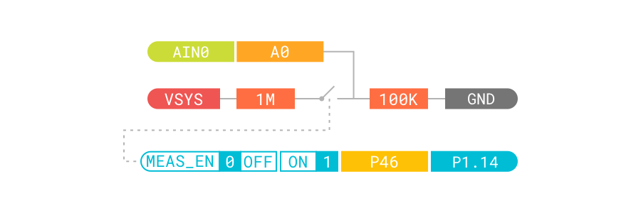

# Voltage Measurement

## Overview

The Voltage Measurement sample demonstrates using Nordic configurations of the Zephyr ADC infrastructure to measure the voltage of the device power supply.

The measurement circuit contains a voltage divider made of two resistors. __AIN0__ measures the voltage over the lower resistor and __P1.14__ is used to enable the voltage measurement. The voltage measurement circuitry is shown in the following figure:



The board devicetree has a `power_vsys_in` node with compatible `voltage-divider`. The voltage is measured using that divider. The devicetree node describing is shown below:

``` dts
power_vsys_in {
    compatible = "voltage-divider";
    io-channels = <&adc 0>;
    output-ohms = <100000>;
    full-ohms = <(1000000 + 100000)>;
    power-gpios = <&gpio1 14 0>;
};
```

## Requirements

Before you start, check that you have the required hardware and software:

- 1x [nRF52840 Connect Kit](https://makerdiary.com/products/nrf52840-connectkit)
- 1x USB-C Cable
- A computer running macOS, Linux, or Windows 7 or newer

## Building the sample

Before you start building, remember to [set up the environment](../setup.md) first.

Use the following steps to build the [Voltage Measurement] sample on the command line.

1. Open a terminal window.

2. Go to `my-workspace/connect-micro-project` directory created in the [Setting up the environment](../setup.md#get-the-code) section.

    ``` bash linenums="1"
    cd my-workspace/connect-micro-project
    ```

3. Build the sample using the `west` command, specifying the board (following the `-b` option) as `connectkit_nrf52840`:

    ``` bash linenums="1"
    west build -p always -b connectkit_nrf52840 samples/voltage_measurement
    ```

    !!! Tip
        The `-p always` option forces a pristine build, and is recommended for new users. Users may also use the `-p auto` option, which will use heuristics to determine if a pristine build is required, such as when building another sample.

4. After running the `west build` command, the build files can be found in `build/zephyr`. 

## Flashing the firmware

The sample is designed to work with the UF2 Bootloader, so that you can easily flash the sample [using the UF2 Bootloader](../../../programming/uf2boot.md). The firmware can be found in `build/zephyr` with the name `zephyr.uf2`.

To flash the firmware, complete the following steps:

1. Push and hold the __USER__ button and plug your board into the USB port of your computer. Release the __USER__ button after your board is connected. The RGB LED turns green.

2. It will mount as a Mass Storage Device called __UF2BOOT__.

3. Drag and drop `zephyr.uf2` onto the __UF2BOOT__ volume. The RGB LED blinks red fast during flashing.

4. Reset the board and the sample will start running.

## Testing

After flashing the firmware to your board, complete the following steps to test it:

1. Connect nRF52840 Connect Kit to your computer using the USB-C Cable.
2. Open up a serial terminal, specifying the correct serial port that your computer uses to communicate with the board:

    === "macOS/Linux"

        Open up a terminal and run:

        ``` bash linenums="1"
        screen <serial-port-name> 115200
        ```

    === "Windows"

        1. Start [PuTTY].
        2. Configure the correct serial port and click __Open__:

            

3. Observe the output of the terminal. You should see the output, similar to what is shown in the following:

    ``` { .bash .no-copy linenums="1" }
    ADC reading:
    - adc@40007000, channel 0: 771 = 451 mV, VSYS = 4961 mV
    ADC reading:
    - adc@40007000, channel 0: 771 = 451 mV, VSYS = 4961 mV
    ADC reading:
    - adc@40007000, channel 0: 769 = 450 mV, VSYS = 4950 mV
    ...
    ```

[Voltage Measurement]: https://github.com/makerdiary/connect-micro-project/tree/main/samples/voltage_measurement
[PuTTY]: https://apps.microsoft.com/store/detail/putty/XPFNZKSKLBP7RJ