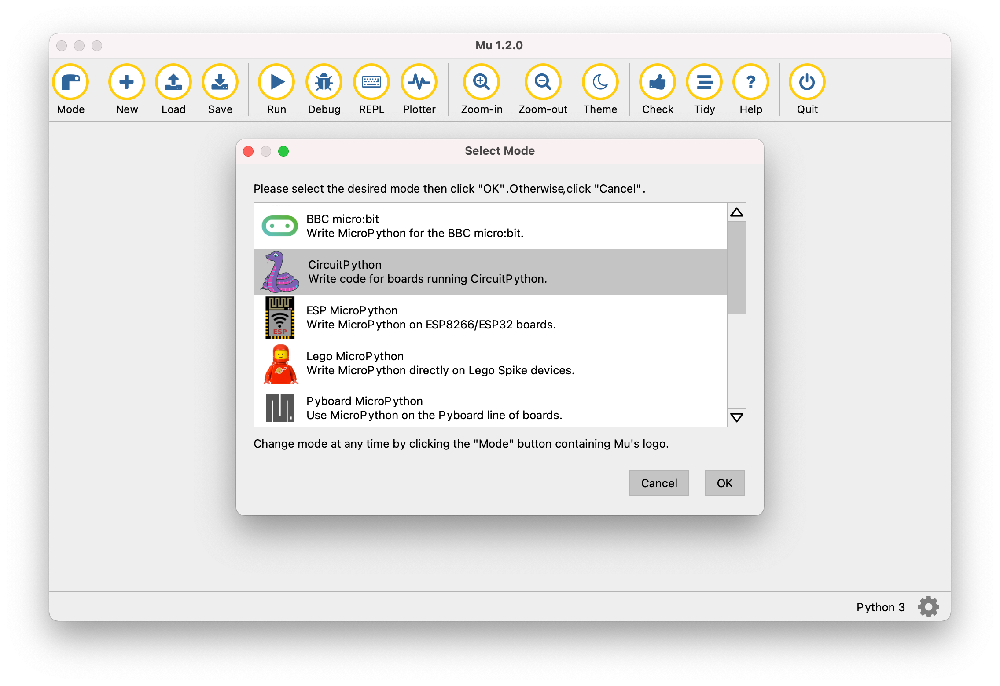

# Getting started with CircuitPython

This section of the documentation takes you through getting up and running with CircuitPython on nRF52840 Connect Kit.

## Requirements

Before you start, check that you have the required hardware and software:

- 1x [nRF52840 Connect Kit](https://makerdiary.com/products/nrf52840-connectkit)
- 1x USB-C Cable
- A computer running macOS, Linux, or Windows 7 or newer

## Installing CircuitPython

The pre-built CircuitPython firmware in `.uf2`-format is located in [`firmware/circuitpython/`](https://github.com/makerdiary/nrf52840-connectkit/tree/main/firmware/circuitpython).

Download the latest firmware and complete the following steps to flash the firmware:

1. Push and hold the __USER__ button and plug your board into the USB port of your computer. Release the __USER__ button after your board is connected. The RGB LED turns green.

2. It will mount as a Mass Storage Device called __UF2BOOT__.

3. Drag and drop `circuitpython-nrf52840_connectkit-en_US-<version>.uf2` onto the __UF2BOOT__ volume. The RGB LED blinks red fast during flashing.

4. Reset the board and CircuitPython will start running. It will mount as a Mass Storage Device called __CIRCUITPY__.


## Coding with Mu Editor

Mu Editor is a simple Python code editor for beginner programmers. Go to [Mu Editor Download page], choose your operating system and follow the instructions to install the latest Mu Editor.

Start Mu Editor, click __Mode__ on Top Menu. You will be prompted to __Select Mode__. Select __CircuitPython__ and click __OK__.



In the text editor, try some Python code:

``` python linenums="1"
print('Hello, CircuitPython!')
```

Click __Save__ on Top Menu. A window will appear. Give the name `code.py` for your code and save it onto the __CIRCUITPY__ drive. Your code will run as soon as the file is done saving.

Click __Serial__ on Top Menu to open a serial data connection to the board. This will result in a new pane between the text editor and Mu’s footer, which prints the data from the board. 


## Using CircuitPython REPL

The CircuitPython REPL (Read-Evaluate-Print-Loop) allows you to enter individual lines of code and have them run immediately. It's really handy if you're running into trouble with a particular program and can't figure out why. It's interactive so it's great for testing new ideas.

To use the REPL, you first need to be connected to the serial console. Here are the common ways you can use to establish a serial connection:

=== "Using Mu Editor"

    Mu Editor has a Serial Console, which can be used to interact with CircuitPython REPL.

    Click __Serial__ on the Mu Editor's Top Menu to open a serial data connection to the board. This will result in a new pane between the text editor and Mu’s footer: 

    ``` { .bash .no-copy linenums="1" }
    Auto-reload is on. Simply save files over USB to run them or enter REPL to disable.
    code.py output:
    Hello, CircuitPython!

    Code done running.

    Press any key to enter the REPL. Use CTRL-D to reload.
    ```

=== "Running `screen`"

    On macOS/Linux, you can open up a terminal and run:

    ``` bash linenums="1"
    screen <serial-port-name> 115200
    ```

    Where `<serial-port-name>` is the correct serial port that your computer uses to communicate with the board.

=== "Using PuTTY"

    On Windows, you can use [PuTTY] to interact with CircuitPython REPL. 

    Start PuTTY, configure the correct serial port and click __Open__:

    

    Where `<serial-port-name>` is the correct serial port that your computer uses to communicate with the board.

Once that connection has been established, type <kbd>CTRL</kbd> + <kbd>C</kbd> to drop into the REPL.

Try to write some Python code in the REPL, then press <kbd>Enter</kbd> :

``` { .python .no-copy linenums="1" }
>>> print('Hello, CircuitPython!')
>>> Hello, CircuitPython!
```

!!! Tip "Return to the Serial Console"
    When you're ready to leave the REPL and return to the serial console, simply press <kbd>CTRL</kbd> + <kbd>D</kbd> . This will reload your board and reenter the serial console. You will restart the program you had running before entering the REPL.

[Mu Editor Download page]: https://codewith.mu/en/download
[PuTTY]: https://apps.microsoft.com/store/detail/putty/XPFNZKSKLBP7RJ
