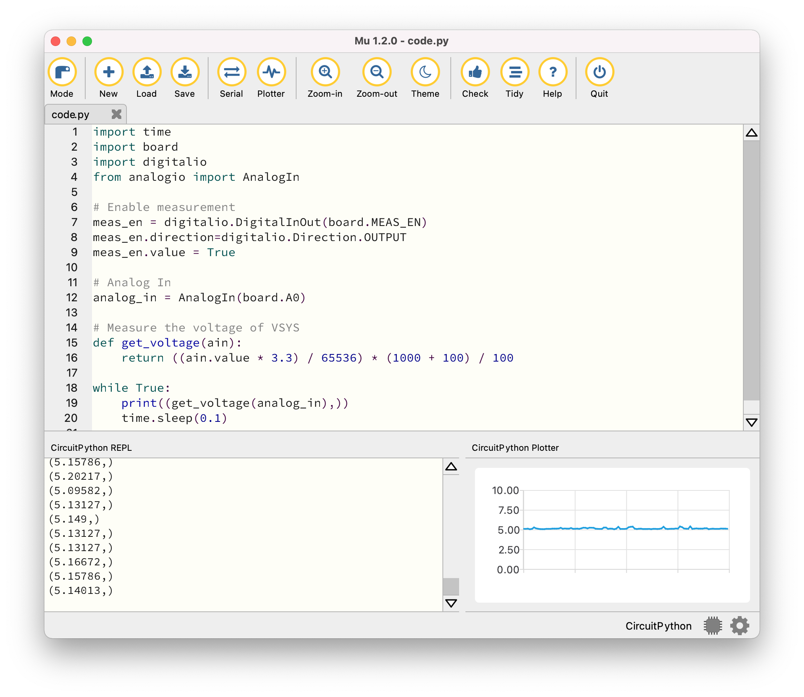

# ADC

The ADC sample demonstrates using the `analogio` module to measure the voltage of the device power supply.

The measurement circuit contains a voltage divider made of two resistors. __AIN0__ (alias __A0__) measures the voltage over the lower resistor and __P1.14__ (alias __MEAS_EN__) is used to enable the voltage measurement. The voltage measurement circuitry is shown in the following figure:


## Requirements

Before you start, check that you have the required hardware and software:

- [nRF52840 Connect Kit](https://makerdiary.com/products/nrf52840-connectkit) running the [CircuitPython] firmware
- 1x USB-C Cable
- [Mu Editor]
- A computer running macOS, Linux, or Windows 7 or newer

## Running the code

To run the code, complete the following steps:

1. Connect nRF52840 Connect Kit to your computer using the USB-C Cable.
2. Start Mu Editor, click __Load__ to open `code.py` in the __CIRCUITPY__ drive.
3. Copy and paste the following code into `code.py` and click __Save__:


    ``` python linenums="1" title="CIRCUITPY/code.py"

    import time
    import board
    import digitalio
    from analogio import AnalogIn

    # Enable measurement
    meas_en = digitalio.DigitalInOut(board.MEAS_EN)
    meas_en.direction=digitalio.Direction.OUTPUT
    meas_en.value = True

    # Analog In 
    analog_in = AnalogIn(board.A0)

    # Measure the voltage of VSYS
    def get_voltage(ain):
        return ((ain.value * 3.3) / 65536) * (1000 + 100) / 100

    while True:
        print((get_voltage(analog_in),))
        time.sleep(0.1)

    ```

4. Your code will run as soon as the file is done saving. Click __Serial__ on Mu Editor's Top Menu to open a serial console. You should see the console output, similar to what is shown in the following:

    ``` { .bash .no-copy linenums="1"}
    Code stopped by auto-reload. Reloading soon.

    Auto-reload is on. Simply save files over USB to run them or enter REPL to disable.
    code.py output:
    (5.149,)
    (5.30852,)
    (5.10468,)
    (5.09582,)
    (5.11355,)
    (5.37942,)
    (5.4769,)
    (5.18444,)
    (5.11355,)
    ...
    ```

5. You can also use the plotter for data inspection. Click __Plotter__ on Mu Editor's Top Menu to open up a plotter pane:

    


[Mu Editor]: ../getting-started.md#coding-with-mu-editor
[CircuitPython]: ../getting-started.md#installing-circuitpython
