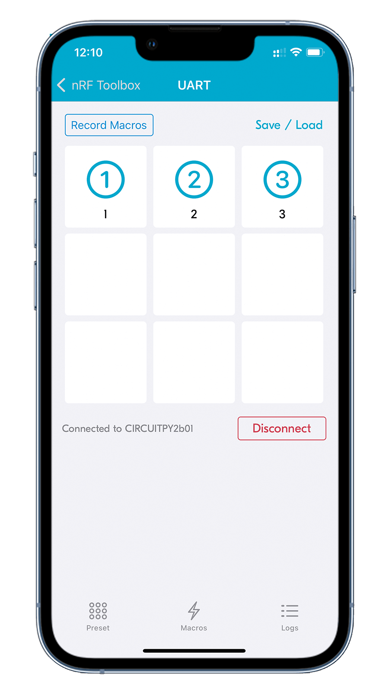

# BLE Nordic UART Service

## Overview

The BLE Nordic UART Service sample demonstrates using Nordic UART Service to control the RGB LED on nRF52840 Connect Kit over Bluetooth Low Energy.

!!! Tip
    `adafruit_ble` is pre-built into [CircuitPython] as a frozen module, so that it can be imported in the code directly.

## Requirements

Before you start, check that you have the required hardware and software:

- [nRF52840 Connect Kit](https://makerdiary.com/products/nrf52840-connectkit) running the [CircuitPython] firmware
- 1x USB-C Cable
- A smartphone or a tablet with [nRF Toolbox] installed
- [Mu Editor]
- A computer running macOS, Linux, or Windows 7 or newer

## Running the code

To run the code, complete the following steps:

1. Connect nRF52840 Connect Kit to your computer using the USB-C Cable.
2. Start Mu Editor, click __Load__ to open `code.py` in the __CIRCUITPY__ drive.
3. Copy and paste the following code into `code.py` and click __Save__:

    ``` python linenums="1" title="CIRCUITPY/code.py"
    import digitalio
    import board
    from adafruit_ble import BLERadio
    from adafruit_ble.advertising.standard import ProvideServicesAdvertisement
    from adafruit_ble.services.nordic import UARTService

    red_led = digitalio.DigitalInOut(board.RED_LED)
    red_led.direction = digitalio.Direction.OUTPUT
    red_led.value = True
    green_led = digitalio.DigitalInOut(board.GREEN_LED)
    green_led.direction = digitalio.Direction.OUTPUT
    green_led.value = True
    blue_led = digitalio.DigitalInOut(board.BLUE_LED)
    blue_led.direction = digitalio.Direction.OUTPUT
    blue_led.value = True

    ble = BLERadio()
    ble.name = "CIRCUITPY NUS"
    uart = UARTService()
    advertisement = ProvideServicesAdvertisement(uart)

    while True:
        ble.start_advertising(advertisement)
        while not ble.connected:
            pass
        while ble.connected:
            # Returns b'' if nothing was read.
            one_byte = uart.read(1)
            if one_byte == b'1':
                red_led.value = not red_led.value
            elif one_byte == b'2':
                green_led.value = not green_led.value
            elif one_byte == b'3':
                blue_led.value = not blue_led.value
    ```

4. Your code will run as soon as the file is done saving. Start the [nRF Toolbox] app, tap <kbd>UART</kbd> to open the UART application.
5. Connect to the device with the name __`CIRCUITPY NUS`__ discovered in the UART application.
6. Tap the blank buttons to create new commands. The following command assignments are configured with __EOL__ set to <kbd>LF</kbd> :

    * :material-numeric-1-circle-outline:{ .nordic } - Send `1` to toggle the __RED LED__.
    * :material-numeric-2-circle-outline:{ .nordic } - Send `2` to toggle the __GREEN LED__.
    * :material-numeric-3-circle-outline:{ .nordic } - Send `3` to toggle the __BLUE LED__.

    { width='160' }
    { width='160' }
    { width='160' }
    { width='160' }

7. Tap :material-numeric-1-circle-outline:{ .nordic } :material-numeric-2-circle-outline:{ .nordic } :material-numeric-3-circle-outline:{ .nordic } to toggle the RGB LED. Observe that the RGB LED on the board turns on or off.

[nRF Toolbox]: https://www.nordicsemi.com/Software-and-Tools/Development-Tools/nRF-Toolbox
[Mu Editor]: ../../getting-started.md#coding-with-mu-editor
[CircuitPython]: ../../getting-started.md#installing-circuitpython