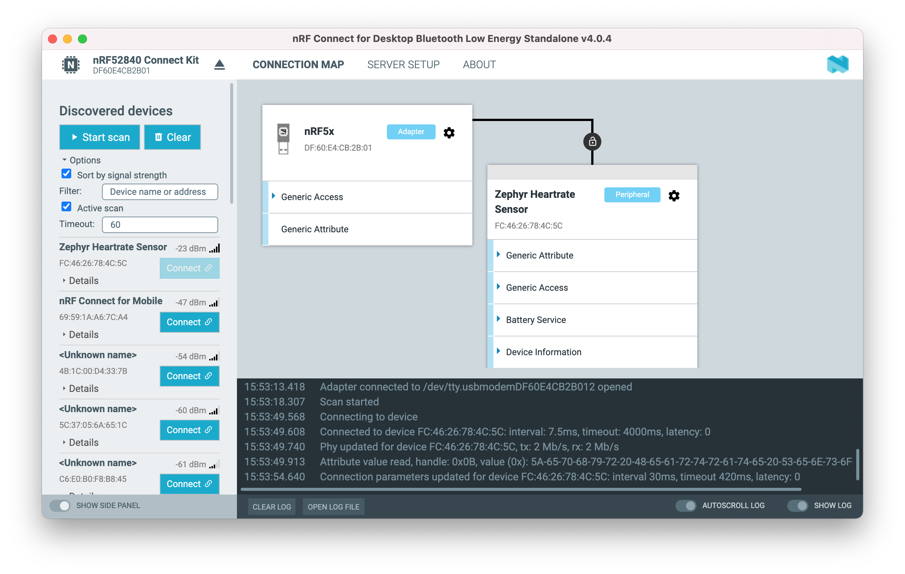
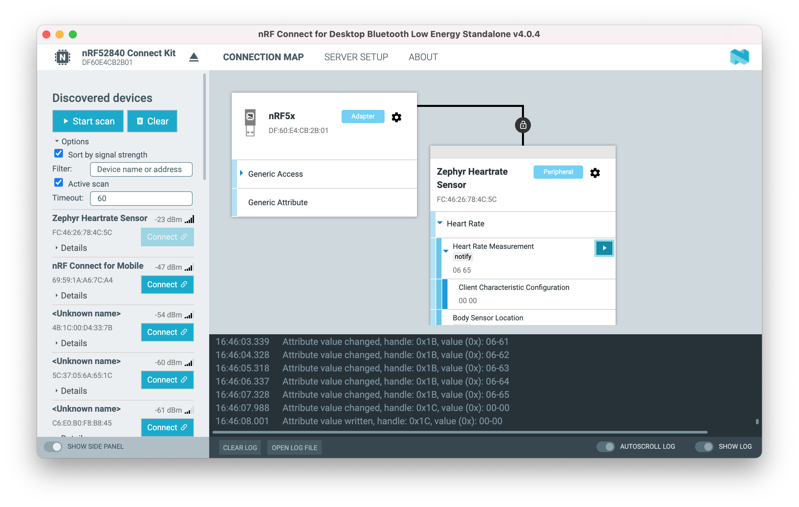

# Out of box experience <small>nRF52840 Connect Kit Quick Start Guide</small>

## Introduction

This guide details the nRF52840 Connect Kit out of box experience. The kit is pre-programmed with a Bluetooth Low Energy Connectivity firmware that allows using nRF Connect Bluetooth Low Energy app to demonstrate Bluetooth Low Energy connectivity.

## Requirements

Before you start, check that you have the required hardware and software:

* 1x [nRF52840 Connect Kit](https://makerdiary.com/products/nrf52840-connectkit)
* 1x USB-C Cable
* A smartphone or a tablet with [nRF Connect for Mobile](https://www.nordicsemi.com/Products/Development-tools/nRF-Connect-for-mobile) installed
* [nRF Connect Bluetooth Low Energy](https://github.com/NordicPlayground/pc-nrfconnect-ble-standalone/releases/) 4.0.1 or later
* A computer running macOS, Linux, or Windows 7 or newer

## Installing the nRF Connect Bluetooth Low Energy

The nRF Connect Bluetooth Low Energy app is an easy-to-use cross-platform application for Bluetooth Low Energy connectivity testing. Choose your Desktop platform and select version (latest released version recommended) to download:

[Download](https://github.com/NordicPlayground/pc-nrfconnect-ble-standalone/releases/){ .md-button .md-button--primary }

After starting the nRF Connect Bluetooth Low Energy app, the application window is displayed.

## Installing the nRF Connect for Mobile

nRF Connect for Mobile app is a powerful generic tool that allows you to scan and explore your Bluetooth Low Energy devices and communicate with them.

[{ width='128' display='inline' }](https://itunes.apple.com/us/app/nrf-connect/id1054362403?ls=1&mt=8)
[{ width='148' display='inline' }](https://play.google.com/store/apps/details?id=no.nordicsemi.android.mcp)

## Connecting the board

The nRF Connect Bluetooth Low Energy app requires a serial port connection to nRF52840 Connect Kit. The board is controlled by the app which sends serialized commands to it over a serial port.

To connect the board, complete the following steps:

1. Connect nRF52840 Connect Kit to the computer by using the USB-C Cable. When the USB device is started, the RGB LED turns blue.

    

2. Open the nRF Connect Bluetooth Low Energy app, in the navigation bar, click on the __SELECT DEVICE__ menu.

3. Select a device by clicking on its name - __nRF52840 Connect Kit__ in the drop-down list.

## Establishing Bluetooth Low Energy connections

The nRF Connect Bluetooth Low Energy app can establish and maintain up to eight simultaneous Bluetooth Low Energy connections.

To connect to devices, complete the following steps:

1. To scan for nearby Bluetooth devices, click the __Start scan__ button in the Discovered devices view.

    The advertising devices start to appear in a list in the Discovered devices view. Each entry in the list shows the name, address, and RSSI of the received advertising packet. 

2. To establish a Bluetooth connection with a peer device, click the __Connect__ button associated with the device.

    

    When the connection has been established, a new peripheral device appears in the Connection Map, to the right of the local device. The nRF Connect Bluetooth Low Energy app automatically performs an initial service discovery. The discovered services are listed below the connected device.

## Viewing service details

The nRF Connect Bluetooth Low Energy app can discover and display services, characteristics, and descriptors of a connected peer device's attribute table.

- To view the handle and UUID of an attribute, move the mouse pointer over the attribute name. A hover text is displayed.
- To view the characteristics of a service, click the __Expand/collapse__ icon :fontawesome-solid-caret-right:{ .nordic } .
- To view descriptors, expand the characteristics.
- To configure the peer device to start sending notifications, click the __Toggle notifications__ icon :fontawesome-solid-square-caret-right:{ .nordic } . When a device receives a notification, the corresponding attribute is highlighted, and its value is updated.

## Setting up advertising

The nRF Connect Bluetooth Low Energy app can also enable the local device to operate as a peripheral that can send connectable advertising packets. The contents of the advertising packets can be configured in the advertising setup.

To start sending advertising packets, complete the following steps:

1. Click the local __Device options__ icon :fontawesome-solid-gear: .
2. Specify the contents of the advertising packets:

    1. To display the Advertising setup dialog, click __Advertising setup__.
    2. From the AD type drop-down menu, select an AD type.
    3. In the Value field, add a data value.
    4. Select __Add to advertising data__ or __Add to scan response__.
    5. Repeat until all wanted fields are present.
    6. Click __Apply__, then click __Close__.

    

3. To start advertising the device, click __Start advertising__.
4. Open nRF Connect for Mobile app, pull down to scan the device:

    { width='250' }

## Next steps

Now, you have finished the nRF52840 Connect Kit out of box experience, it's time to learn more essential developer guides.

To learn how to program the nRF52840 Connect Kit, check out this guide:

* [How to program the nRF52840 Connect Kit](./programming/index.md)

You can also make the nRF52840 Connect Kit as a Bluetooth LE or IEEE 802.15.4-based (such as Thread and ZigBee) packet sniffer, which can help identify and fix issues by allowing a view of what is happening on-air. Follow these guides to setup:

* [nRF Sniffer for Bluetooth LE](./guides/ble-sniffer/index.md)
* [nRF Sniffer for 802.15.4](./guides/nrf802154-sniffer/index.md)

To quickly get started with the nRF Connect SDK development, check the guide below for instructions:

* [Develop with nRF Connect SDK](./guides/ncs/index.md)

nRF52840 Connect Kit also offers Python support, allowing you access hardware-specific functionality and peripherals with Python programming language:

* [Code in Python](./guides/python/index.md)
